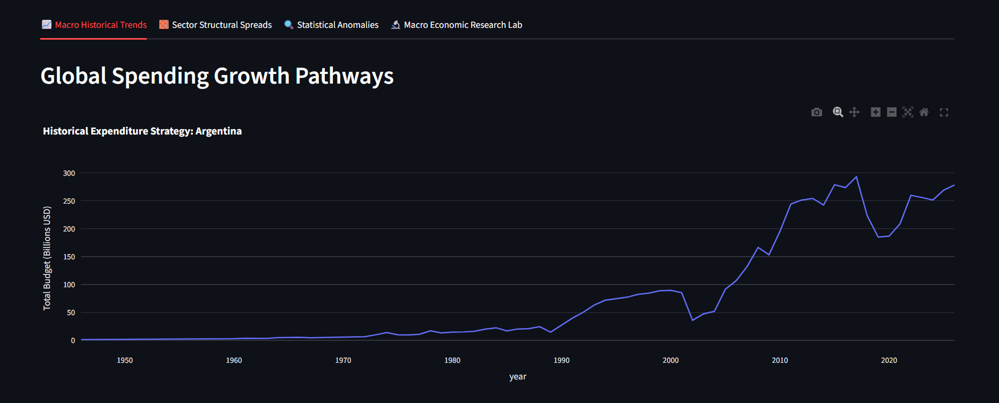
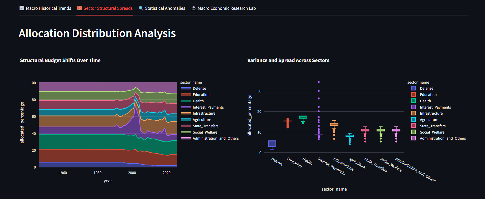
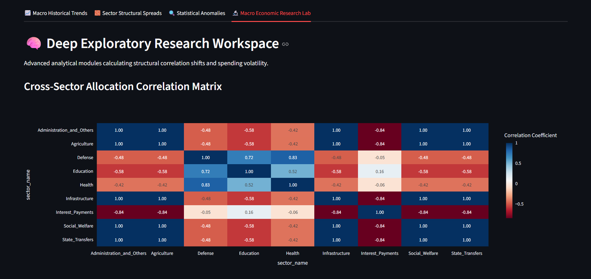
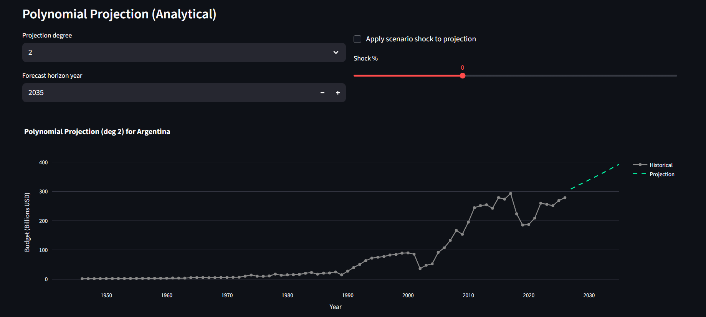

<div align="center">

# 🏛️ Global Government Budget Analytics Core

### An End-to-End Python + MySQL + Streamlit Platform for Exploring 80 Years of Government Spending

[](https://www.python.org/)
[](https://www.mysql.com/)
[](https://streamlit.io/)
[](https://pandas.pydata.org/)
[](LICENSE)

**📊 45 Countries • 🗓️ 1946–2026 • 🧮 3,654+ Budget Records • 🧱 9 Government Sectors**

[Overview](#-project-overview) •
[Features](#-features) •
[Installation](#-installation-guide) •
[Dashboard](#-dashboard-explanation) •
[File Guide](#-python-file-explanations) •
[Contributing](#-future-improvements)

</div>

---

## 📖 Project Overview

**Global Government Budget Analytics Core** is a full-stack data analytics
project that turns raw historical government budget data into an
**interactive, explorable dashboard**. It covers **45 countries** from
**1946 to 2026**, tracking how each government has split its total budget
across **9 major sectors** — Defense, Education, Health, Infrastructure,
Agriculture, Interest Payments, State Transfers, Social Welfare, and
Administration.

The project is built the way real-world data platforms are built:

```
Raw CSV  →  ETL Pipeline  →  Normalized MySQL Database  →  Python/SQL Analytics  →  Streamlit Dashboard
```

It is designed as a **portfolio-grade project** for anyone learning data
engineering, SQL analytics, or dashboard development — every layer (ETL,
database design, statistics, visualization) is visible, readable, and
documented.

---

## ❓ Problem Statement

Government budget data is usually published as messy, wide-format spreadsheets
that are hard to compare across countries or years. Analysts and students who
want to answer questions like:

- *"Which countries prioritize education over defense?"*
- *"How volatile has a country's budget been over the last decade?"*
- *"Are health and education spending correlated?"*
- *"What will a country's budget look like in 2035?"*

...usually have to write repetitive, one-off scripts. This project solves that
by building a **single reusable analytics core**: one clean database schema,
one ETL pipeline, and a library of statistical modules that any country or
year range can be plugged into instantly.

---

## 🎯 Objectives

- ✅ Design a normalized relational database for multi-country, multi-year budget data
- ✅ Build a reliable ETL pipeline to load raw CSV data into MySQL
- ✅ Write advanced SQL (window functions, CTEs, ranking) for deep analytics
- ✅ Apply statistical methods (rolling volatility, Z-score outliers, Pearson correlation, polynomial regression) using Python
- ✅ Present everything through an interactive, filterable Streamlit dashboard
- ✅ Package the project so it is easy for anyone to clone, install, and run

---

## ✨ Features

| Module | What it does |
|---|---|
| 🔄 **ETL Pipeline** | Loads the master CSV into a normalized MySQL schema (countries → budgets → sector allocations) |
| 📈 **Macro Trends** | Interactive line charts of total budget growth per country |
| 🧱 **Sector Spreads** | Area charts + box plots showing how sector shares shift over time |
| 🔍 **Outlier Detection** | Flags fiscal years where spending deviates > 1.96 standard deviations (95% confidence) from the historical mean |
| 📊 **Cross-Sector Correlation** | Pearson correlation heatmap between all 9 government sectors |
| 🌊 **Budget Volatility Index** | 10-year rolling coefficient of variation to measure spending stability |
| 🔮 **Polynomial Forecasting** | Projects future budgets (2025–2050) using NumPy least-squares curve fitting, with an optional "shock scenario" slider |
| 🪖 **Guns vs. Butter Ratio** | Ranks countries by civilian (Education + Social Welfare) vs. Defense spending ratio |
| 🧮 **Advanced SQL Analytics** | 5-year rolling averages and "#1 funded sector per year" rankings using SQL window functions and `DENSE_RANK()` |

---

## 🛠️ Technologies Used

| Layer | Technology |
|---|---|
| **Language** | Python 3.10+ |
| **Database** | MySQL 8.0 |
| **Dashboard / UI** | Streamlit |
| **Data Handling** | Pandas, NumPy |
| **Database Connectivity** | SQLAlchemy, `mysql-connector-python`, PyMySQL |
| **Visualization** | Plotly Express & Plotly Graph Objects |
| **Config / Secrets** | python-dotenv |
| **Version Control** | Git & GitHub |

---

## 🏗️ System Architecture

```
┌────────────────────┐      ┌──────────────────┐      ┌─────────────────────┐
│  Master CSV Dataset│ ───▶│   ETL Pipeline    │ ───▶│   MySQL Database    │
│ (3,654 budget rows)│      │  (Python_sql.py) │      │(3 normalized tables)│
└────────────────────┘      └──────────────────┘      └──────────┬──────────┘
                                                                 │
                                       ┌─────────────────────────┼─────────────────────────┐
                                       ▼                         ▼                         ▼
                                ┌──────────────────┐    ┌───────────────────┐     ┌────────────────────┐
                                │ Analytics Modules│    │ Advanced SQL Layer│     │ Streamlit Dashboard│
                                │(volatility, corr,│    │ (window functions,│     │ (main_dashboard.py)│
                                │outliers,forecast)│    │  CTEs, ranking)   │     │                    │
                                └──────────────────┘    └───────────────────┘     └────────────────────┘
```

**Design principle:** the database is the single source of truth. Every
analytics script and the dashboard itself query MySQL independently — nothing
is hardcoded or duplicated.

---

## 🔄 Project Workflow

1. **Data Collection** — Historical government budget data compiled into `Master_Global_Budgets_Historical.csv`
2. **ETL & Loading** — `etl/Python_sql.py` reads the CSV, seeds the `countries` dimension table, then inserts one `budgets` row and nine `sector_allocations` rows per record
3. **Database Storage** — MySQL stores the data in a normalized 3-table schema (see below)
4. **Analytics Layer** — Standalone Python scripts in `analytics/` run statistical and SQL-based analysis on demand
5. **Visualization Layer** — `app/main_dashboard.py` connects to MySQL live and renders everything as interactive Plotly charts inside Streamlit tabs
6. **Exploration** — End users pick a country from the sidebar and explore Macro Trends, Sector Spreads, Anomalies, and the Research Lab

---

## 🗄️ Database Design

The schema is a classic **star-style, normalized design** with one dimension
table and two fact tables, connected by foreign keys:

```
countries                budgets                        sector_allocations
──────────                ───────                        ───────────────────
country_id (PK)   ─┐      budget_id (PK)          ┌───▶  allocation_id (PK)
country_name        └───▶ country_id (FK)          │      budget_id (FK)
                           year                      │      sector_name
                           total_budget_billions_usd ┘      allocated_percentage
                                                             allocated_amount_billions_usd
```

**Why this design?**
- `countries` avoids repeating country names across thousands of rows
- `budgets` stores one row per country-year (with a `UNIQUE(country_id, year)` constraint to prevent duplicates)
- `sector_allocations` **unpivots** the 9 wide sector columns from the CSV into a long/tidy format — this is what makes SQL window functions, `GROUP BY`, and pivoting in Pandas so easy
- Foreign keys use `ON DELETE CASCADE` so deleting a country automatically cleans up its budgets and allocations
- Indexes on `year` and `sector_name` speed up the most common analytical filters

Full schema definition: [`database/Database.sql`](database/Database.sql)

---

## 📁 Folder Structure

```
Global-Government-Budget-Analytics-Core/
│
├── app/
│   └── main_dashboard.py          # Streamlit dashboard (entry point)
│
├── etl/
│   └── Python_sql.py              # CSV → MySQL ETL pipeline
│
├── analytics/
│   ├── advance_query.py           # Advanced SQL window functions & CTEs
│   ├── budget_volatility.py       # Rolling volatility index (CoV)
│   ├── correlations.py            # Cross-sector Pearson correlation
│   ├── defense_social.py          # Guns vs. Butter ratio analysis
│   ├── forecasting_engine.py      # Polynomial regression forecasting
│   └── outlier_det.py             # Z-score anomaly detection
│
├── database/
│   └── Database.sql               # Full MySQL schema (DDL)
│
├── data/
│   ├── Master_Global_Budgets_Historical.csv
│   ├── individual_countries/      # Same data, split per country
│   └── README.md
│
├── screenshots/                   # Dashboard screenshots for this README
├── .env.example                   # Template for DB credentials
├── .gitignore
├── requirements.txt
├── LICENSE
└── README.md
```

---

## ⚙️ Installation Guide

### Prerequisites
- Python **3.10+**
- MySQL Server **8.0+** (running locally or remotely)
- `pip` and `git`

### Step 1 — Clone the repository
```bash
git clone https://github.com/<your-username>/Global-Government-Budget-Analytics-Core.git
cd Global-Government-Budget-Analytics-Core
```

### Step 2 — Create a virtual environment (recommended)
```bash
python -m venv venv
source venv/bin/activate      # On Windows: venv\Scripts\activate
```

### Step 3 — Install dependencies
```bash
pip install -r requirements.txt
```

### Step 4 — Configure your database credentials
```bash
cp .env.example .env
```
Then edit `.env` with your own local MySQL username/password. All scripts
read these values via environment variables — **never hardcode real
credentials in code you push to GitHub.**

---

## 📦 requirements.txt

```txt
streamlit>=1.36.0
pandas>=2.2.0
numpy>=1.26.0
SQLAlchemy>=2.0.30
mysql-connector-python>=8.4.0
PyMySQL>=1.1.1
plotly>=5.22.0
python-dotenv>=1.0.1
```

---

## 🗃️ How to Import the SQL Database

1. Open a terminal and log in to MySQL:
   ```bash
   mysql -u root -p
   ```
2. Run the schema file to create the database and tables:
   ```bash
   source database/Database.sql;
   ```
   or, from your regular terminal (not the MySQL shell):
   ```bash
   mysql -u root -p < database/Database.sql
   ```
3. Confirm the database was created:
   ```sql
   SHOW DATABASES;
   USE global_budget_db;
   SHOW TABLES;
   ```

---

## ▶️ How to Run the Project

### 1. Load the data (run once)
```bash
cd etl
python Python_sql.py
```
This reads `data/Master_Global_Budgets_Historical.csv`, seeds the `countries`
table, then inserts every budget and sector-allocation record into MySQL.

### 2. Launch the dashboard
```bash
cd app
streamlit run main_dashboard.py
```
Streamlit will open the dashboard automatically in your browser at
`http://localhost:8501`.

### 3. (Optional) Run standalone analytics scripts
```bash
python analytics/budget_volatility.py
python analytics/outlier_det.py
python analytics/forecasting_engine.py
```

---

## 📊 Dashboard Explanation

The dashboard (`app/main_dashboard.py`) is organized into **4 tabs**, with a
country selector in the sidebar that filters every chart:

| Tab | What you see |
|---|---|
| 📈 **Macro Historical Trends** | A line chart of total budget (Billions USD) across all available years for the selected country |
| 🧱 **Sector Structural Spreads** | A stacked area chart showing how each sector's share of the budget has changed over time, plus a box plot showing the spread/variance of each sector |
| 🔍 **Statistical Anomalies** | Automatically flags fiscal years where total spending is a statistical outlier (Z-score beyond ±1.96, i.e. outside a 95% confidence band) |
| 🔬 **Macro Economic Research Lab** | The deep-dive tab: a cross-sector correlation heatmap, a 10-year rolling volatility index chart, and an interactive polynomial forecasting tool (choose the polynomial degree, forecast horizon, and even apply a "shock" percentage scenario) |

---

## 🐍 Python File Explanations

| File | Purpose |
|---|---|
| **`etl/Python_sql.py`** | The ETL pipeline. Reads the master CSV, fills missing values, seeds the `countries` table, then loops through every row to insert one `budgets` record and nine unpivoted `sector_allocations` records. Wrapped in try/except with a final commit for data integrity. |
| **`app/main_dashboard.py`** | The Streamlit application. Builds the sidebar country filter, four analytical tabs, and all Plotly visualizations by querying MySQL live. |
| **`analytics/advance_query.py`** | Demonstrates advanced SQL: a **window function** (`AVG() OVER (...)`) for a 5-year rolling budget average, and a **CTE + `DENSE_RANK()`** query to find the #1 funded sector per country per year. |
| **`analytics/budget_volatility.py`** | Uses Pandas `.rolling(window=10)` to compute a 10-year rolling mean and standard deviation, then derives a **Volatility Index** (coefficient of variation) to measure how erratically a country's budget has moved. |
| **`analytics/correlations.py`** | Pivots long-format sector data into a wide table (years × sectors) and computes a **Pearson correlation matrix** to reveal which sectors move together (or in opposite directions). |
| **`analytics/defense_social.py`** | A single conditional-aggregation SQL query (`MAX(CASE WHEN ...)`) that pivots Defense, Education, and Social Welfare percentages into columns and computes a **civilian-to-defense spending ratio**, ranked across all countries for a chosen year. |
| **`analytics/forecasting_engine.py`** | Fits an **n-degree polynomial** to historical budget data using `numpy.polyfit`, then extrapolates that trend line forward to a target year (e.g. 2035) — a pure statistical/analytical forecast (no external ML libraries). |
| **`analytics/outlier_det.py`** | Computes the mean and standard deviation of a country's full budget history, derives Z-scores, and flags any year where `|Z| > 1.96` as a statistical anomaly. |
| **`database/Database.sql`** | The complete DDL: creates the database and the three normalized tables (`countries`, `budgets`, `sector_allocations`) with primary keys, foreign keys, unique constraints, and indexes. |

---

## 📁 Dataset Explanation

**Source file:** `data/Master_Global_Budgets_Historical.csv`
**Rows:** 3,654 | **Countries:** 45 | **Years:** 1946–2026

Each row represents **one country's budget in one year**, with 19 columns:

| Column | Description |
|---|---|
| `Country` | Country name |
| `Year` | Fiscal year |
| `Total_Budget_Billions_USD` | Total government budget for that year |
| `<Sector>_Percentage` | % of total budget allocated to a sector |
| `<Sector>_Amount_Billions_USD` | Dollar amount allocated to a sector |

**The 9 tracked sectors** are:
`Defense`, `Education`, `Health`, `Interest_Payments`, `Infrastructure`,
`Agriculture`, `State_Transfers`, `Social_Welfare`, `Administration_and_Others`

The `data/individual_countries/` folder additionally contains the same
dataset **pre-split into one CSV per country** (45 files), useful for quick
manual inspection without needing to query the database.

---

## 📐 Statistical Methods Used

| Method | Where it's used | What it measures |
|---|---|---|
| **Rolling Mean / Rolling Std Dev** | `budget_volatility.py`, dashboard Research Lab | Smooths noise and measures recent spending stability over a 10-year window |
| **Coefficient of Variation (Volatility Index)** | `budget_volatility.py` | `(rolling_std / rolling_mean) × 100` — a normalized measure of budget instability |
| **Z-Score Outlier Detection** | `outlier_det.py`, dashboard Anomalies tab | Flags years where spending is more than ~2 standard deviations from the historical mean (95% confidence) |
| **Pearson Correlation Coefficient** | `correlations.py`, dashboard heatmap | Measures the linear relationship between sector allocations (e.g., does Health spending rise when Education spending rises?) |
| **Least-Squares Polynomial Regression** | `forecasting_engine.py`, dashboard forecasting tool | Fits a trend curve (`numpy.polyfit`) to historical data and extrapolates it into future years |
| **SQL Window Functions (`AVG() OVER`, `DENSE_RANK()`)** | `advance_query.py` | Computes rolling averages and per-group rankings directly inside MySQL for performance |

---

## 🧮 SQL Queries Explanation

- **5-Year Rolling Average** — Uses `AVG(...) OVER (PARTITION BY country ORDER BY year ROWS BETWEEN 4 PRECEDING AND CURRENT ROW)` to smooth each country's budget trend without leaving SQL.
- **Sector Dominance Ranking** — A `WITH RankedSectors AS (...)` CTE applies `DENSE_RANK()` per country/year to isolate whichever sector received the **largest** share of the budget that year.
- **Guns vs. Butter Ratio** — Uses `MAX(CASE WHEN sector_name = 'X' THEN value END)` (a manual pivot) inside a single `GROUP BY` query to compare Defense spending against combined Education + Social Welfare spending, avoiding a Python-side pivot entirely.

---

## 🖼️ Screenshots


| Macro Trends | Sector Spread |
|---|---|
|  |  |

| Correlation Heatmap | Forecasting |
|---|---|
|  |  |

---

## 🚀 Future Improvements

- [ ] Add unit tests (`pytest`) for the ETL pipeline and analytics functions
- [ ] Containerize the project with Docker + `docker-compose` (app + MySQL)
- [ ] Deploy the dashboard publicly via Streamlit Community Cloud
- [ ] Add a multi-country comparison view (currently single-country filtering only)
- [ ] Add GDP-normalized budget metrics (spending as % of GDP)
- [ ] Add CI/CD with GitHub Actions for linting and testing
- [ ] Cache database queries with `st.cache_data` for faster dashboard loads
- [ ] Replace manual pivoting with a lightweight data-access layer / ORM (SQLAlchemy models)

---

## 📄 License

This project is licensed under the **MIT License** — see the [LICENSE](LICENSE) file for details.

---

## 👤 Author

**Anant Mittal**
🔗 GitHub: (https://github.com/anantmittal15-git)
🔗 LinkedIn: (https://www.linkedin.com/in/anantmittal15)
✉️ Email: mittalanant15@gmail.com

> Built as a portfolio project to demonstrate end-to-end data engineering,
> SQL analytics, and dashboard development skills.

---

## 🔑 Keywords

`python` `mysql` `streamlit` `data-analytics` `data-engineering` `etl-pipeline`
`sql-window-functions` `government-budget` `public-finance` `data-visualization`
`plotly` `pandas` `numpy` `forecasting` `correlation-analysis`
`outlier-detection` `time-series-analysis` `portfolio-project` `dashboard`
`sqlalchemy` `data-science`

---

<div align="center">

⭐ **If you found this project useful, consider giving it a star!** ⭐
